# MBTA Real-Time Data Collector

> Mini production-style MBTA (Massachusetts Bay Transportation Authority) data ingestion system collecting vehicle data every 10s and alerts every 60s with automated archival, reliability monitoring, and operational analysis.

- [Overview](#overview)
- [Problem & Motivation](#problem--motivation)
- [Solution Overview](#solution-overview)
- [System Architecture](#system-architecture)
    - [Core Components](#core-components)
    - [Overall Data Flow](#overall-data-flow)
- [API Ingestion Design](#api-ingestion-design)
- [Deployment & Scheduling](#deployment--scheduling)
- [Data Storage & Logging Strategy](#data-storage--logging-strategy)
- [Reliability & Monitoring for January 2026](#reliability--monitoring-for-january-2026)
    - [Data Collection Reliability](#data-collection-reliability)
    - [Scheduler Alignment](#scheduler-alignment)
    - [API Performance Latency](#api-performance-latency)
    - [Data Volume & Storage Behavior](#data-volume--storage-behavior)
    - [Archive Job Performance](#archive-job-performance)
- [Observed Transit System Patterns](#observed-transit-system-patterns)
- [Lessons Learned](#lessons-learned)

## Overview

An automated system was developed to capture MBTA vehicle data every 10 seconds and service alerts every 60 seconds, storing the information in a structured archive suitable for long-term analysis.

## Problem & Motivation

The initial goal was to experiment with building a transit-style visualization of the MBTA system, driven by real historical movement data rather than simulation.

The MBTA API provides real-time vehicle and alert data but does not offer historical archives. Accurate visualizations of past vehicle movement require frequent data snapshots. Lower polling intervals result in data gaps that necessitate interpolation. This limitation was addressed by collecting frequent, real observations.

To address this need, a system was implemented to collect vehicle data every 10 seconds and store structured snapshots over time. Service alerts are collected in parallel to provide contextual signals that may help explain disruptive patterns.

Although the project began as a visualization experiment, it evolved over time. The system's scope expanded from visualization to include automated data collection, service orchestration, and operational reliability.

## Solution Overview

To support high-frequency historical data collection, a small production-style ingestion system was designed and deployed on a Linux server.

The system consists of:

- Independent Python collectors for vehicles and service alerts
- Scheduled execution via systemd timers
- Append-only JSONL storage partitioned by date and hour
- Structured logging for observability and debugging

Vehicle data is captured every 10 seconds for minimal interpolation.

Service alerts are collected every 60 seconds, as they change less often and provide context.

Each collector retrieves current API data and writes a structured record with metadata (timestamp, latency, run ID) and the raw payload.

This process builds a historical archive suitable for visualization, analysis, or future research.

This small system maintains operational discipline through explicit request timeouts, structured error recording, time-partitioned file storage, and automated scheduling and restart management.

## System Architecture

The system, deployed on a DigitalOcean Linux droplet, separates ingestion, scheduling, storage, and archival. It reflects a production-style service design in a minimal form.

### Core Components

#### Collector Scripts

`vehicles-collector.py`, `alerts-collector.py`

These scripts fetch data from the MBTA API, attach execution metadata, and append structured JSONL records to time-partitioned files.

Vehicle data is collected every 10 seconds to capture movement with minimal interpolation.

Alert data is collected every 60 seconds, as alerts change infrequently and provide context.

#### Service Orchestration

Each script is managed by:

- A `.service` unit
- A corresponding `.timer` unit

Timers ensure deterministic execution and recover missed runs after reboots.

#### Time-Partitioned Storage

Data is written to `/root/mbta-data/` and partitioned by:

- Date (`YYYY-MM-DD`)
- Hour (one JSONL file per hour)

Files are append-only, with one structured record written per scheduled collection run.

#### Daily Archival & Retention

A dedicated script, archive-upload.py, runs daily at 00:05 using systemd. The script aggregates all data files from the previous day, uploads the complete set to Backblaze B2 object storage for backup, and then removes the local copies. This process ensures that completed data for each day is securely archived and that local storage usage remains within the droplet's disk limits.

This process ensures completed data is safely uploaded offsite, keeps local disk use minimal, and provides a robust, durable archive for long-term analysis.

---

### Overall Data Flow

#### Collection

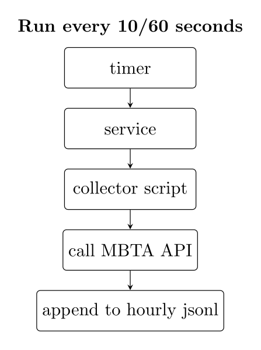

#### Archival

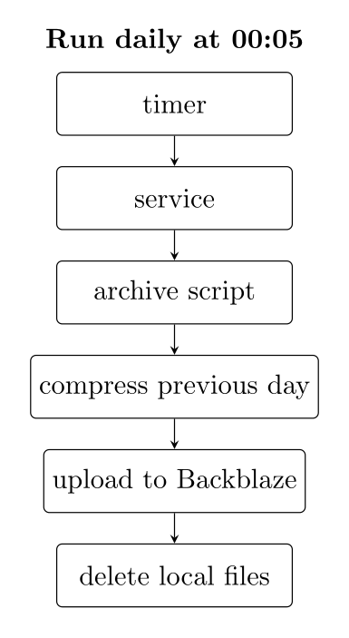

## API Ingestion Design

Each run issues one HTTP request, measures latency, and records the result to disk.

### Endpoints

- Vehicles: `GET https://api-v3.mbta.com/vehicles`
- Alerts: `GET https://api-v3.mbta.com/alerts`

An API key is used when available via an environment variable:

- `MBTA_API_KEY` is sent as header `x-api-key`

### Execution metadata

Every run generates:

- `run_id` — a UUID for tracing one execution across files/logs
- `timestamp` — timezone-aware (`America/New_York`) ISO 8601 timestamp
- `latency` — measured using `time.monotonic()` to avoid clock-skew issues

### Storage format: append-only JSONL

Each execution appends a JSON object to an hourly JSONL file, partitioned by date and hour for manageability.

Base directory:

- `/root/mbta-data`

Hourly JSONL files:

- Vehicles: `/root/mbta-data/YYYY-MM-DD/vehicles/vehicles_YYYY-MM-DD_HH.jsonl`
- Alerts: `/root/mbta-data/YYYY-MM-DD/alerts/alerts_YYYY-MM-DD_HH.jsonl`

Success record (vehicles):

- `run_id`, `timestamp`, `num_vehicles`, `data`

Success record (alerts):

- `run_id`, `timestamp`, `num_alerts`, `data`

### Failure handling

Collectors use a 5-second timeout to maintain their schedule.

If a request fails (timeout, connection error, non-2xx response), the collector still appends a structured error record so that missing data is explicit rather than silent:

- `run_id`
- `timestamp`
- `http_status` (if available)
- `latency`
- `error_type`, `error`
- `data: null`

One line is logged per run, making outages and API issues easy to detect.

### Operational logging

In addition to JSONL snapshots, each run appends a single structured log line to a daily log file:

- Vehicles: `/root/mbta-data/YYYY-MM-DD/vehicles-YYYY-MM-DD.log`
- Alerts: `/root/mbta-data/YYYY-MM-DD/alerts-YYYY-MM-DD.log`

Log lines use a consistent `key="value"` format with fields `run_id`, `timestamp`, `http_status`, `latency`, and a count field (`vehicles` or `alerts`), enabling quick inspection with standard CLI tools.

## Deployment & Scheduling

All scheduling is handled by systemd services and timers. Unit files are installed under `/etc/systemd/system/` on the droplet. This keeps the scheduling configuration separate from the Python code.

### Collector Scheduling

Each collector runs as a `Type=oneshot` service, executing a single collection task per scheduled run.

Vehicles are collected every 10 seconds using multiple timers:

- `vehicles-collector-00.timer`
- `vehicles-collector-10.timer`
- `vehicles-collector-20.timer`
- `vehicles-collector-30.timer`
- `vehicles-collector-40.timer`
- `vehicles-collector-50.timer`

Separate timers prevent drift and keep execution aligned with wall-clock time.

Each timer triggers:

- `vehicles-collector.service`

Alerts are collected once per minute at second `:05` via:

- `alerts-collector.timer`
- `alerts-collector.service`

All timers use:

- `OnCalendar` to define an exact execution schedule rather than relying on sleep-based loops
- `AccuracySec=1s` to minimize scheduling drift and keep intervals consistent
- `Persistent=true` to ensure missed executions run after downtime or reboots

Because collectors run as `Type=oneshot` jobs and each HTTP request uses a short timeout, individual runs are expected to complete well within their scheduling interval. This helps avoid overlapping executions, such as a new run starting before the previous one finishes. If a run ever takes too long, the structured error records and logs make it easy to detect and investigate.

---

### Archival Scheduling

A separate daily archival job runs at 00:05:

- `mbta-archive.timer`
- `mbta-archive.service`

The archive job aggregates the previous day's data, uploads it, and deletes local files to limit storage.

`Persistent=true` ensures the archival job runs even after a reboot.

---

### Environment Configuration

Environment variables (e.g., `MBTA_API_KEY`) are stored in:

- `/etc/mbta-collector.env`
- `/etc/mbta-archive.env`

This prevents secrets from being hardcoded into code or unit files.

## Data Storage & Logging Strategy

The storage layer is append-only and time-partitioned for integrity and analysis.

### Append-Only Design

Each scheduled execution writes exactly one JSON record to disk.  
Files remain unchanged after creation.

This approach:

- Prevents corruption from partial failures
- Makes data gaps explicit
- Enables simple streaming or batch processing
- Guarantees one record per scheduled run

### Time Partitioning

Data is partitioned by:

- Date (`YYYY-MM-DD`)
- Hour (one file per hour)

This keeps file sizes bounded and makes it easy to:

- Process specific time windows
- Archive entire days
- Clean up local storage efficiently

Timestamps are stored in `America/New_York` to align with MBTA operations and reduce ambiguity during daylight saving transitions.

### Bounded Retention

To prevent unbounded disk growth:

- Data is archived daily to Backblaze B2
- Local copies are deleted after upload
- systemd timers ensure archival jobs execute reliably (`Persistent=true`)

This creates a predictable storage lifecycle and maintains long-term durability.

## Reliability & Monitoring for January 2026

January 2026 included several external factors that materially influenced observed system behavior. The month contained U.S. federal holidays (New Year’s Day and Martin Luther King Jr. Day) and a major winter storm in the Boston area that delivered over 20 inches (50 cm) of snowfall between January 26 and January 27, substantially disrupting regional transit operations.

These events affected transit activity levels and likely influenced API load, vehicle density, latency, and error patterns. Weekend and holiday shading in the plots reflects these contextual shifts, and late-January variability corresponds to the storm period.

The following sections evaluate system reliability and performance within this real-world operating context.

---

### Data Collection Reliability

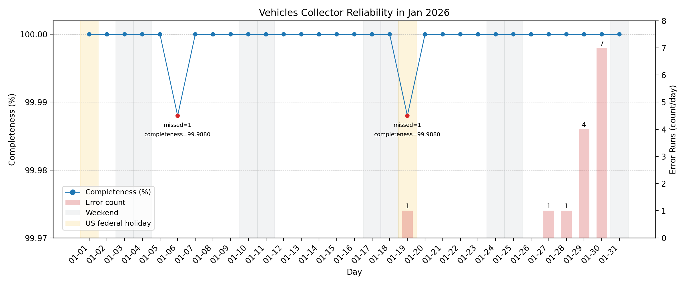
The vehicles collector executed at 10-second intervals (8,640 expected runs per day). Across January 2026 (267,840 expected runs), 267,838 runs were recorded, yielding nearly 99.99% completeness.

Two isolated single-interval gaps (≈20 seconds each) were observed on Jan 6 and Jan 19. These appear consistent with minor scheduler jitter or brief transient interruption rather than systemic instability.

Fourteen transient ReadTimeout events occurred during the month, indicating that the MBTA API exceeded the 5-second client timeout. These timeouts did not cascade into subsequent missed runs.

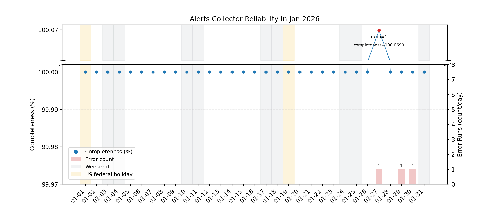
The alerts collector executed at 60-second intervals (1,440 expected runs per day). Across January 2026 (44,640 expected runs), execution completeness remained effectively 100%.

A small number of transient request errors occurred late in the month, each isolated to a single interval. These did not impact overall completeness.

One day (Jan 27) shows raw completeness slightly above 100% due to a manually triggered execution outside the scheduled cadence. This did not affect scheduling stability, and no duplicate timer triggers were observed.

### Scheduler Alignment

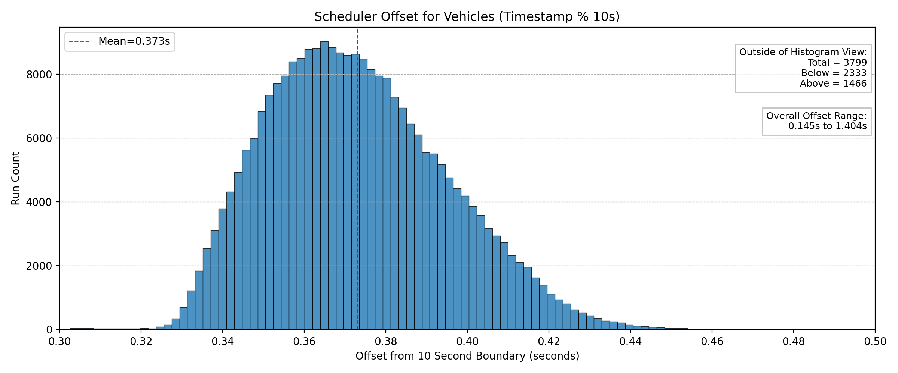

This histogram shows the scheduler offset for the 10-second vehicle collector cadence (timestamp modulo 10 seconds). Runs execute with a consistent mean offset of ~0.373 seconds from the wall-clock boundary, with the vast majority tightly clustered between ~0.33 and ~0.42 seconds. The full observed range (0.145s–1.404s) reflects normal OS scheduling variance.

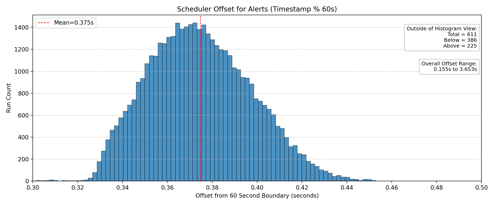
The alerts collector exhibits a similarly tight execution offset distribution, centered around ~0.375 seconds past each 60-second boundary.

### API Performance Latency

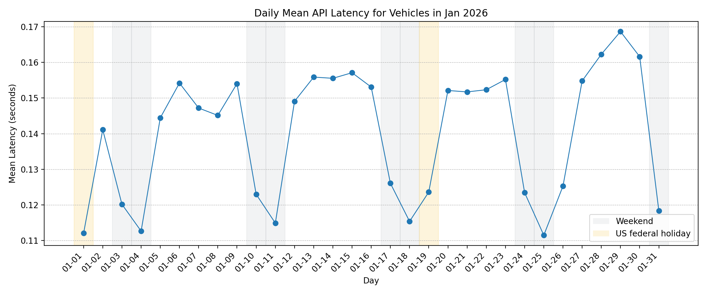

The daily mean latency for the vehicles endpoint remained low and stable throughout January, generally ranging from ~0.11 to ~0.17 seconds. A modest increase is visible during the late-January winter storm window, but values returned to baseline immediately afterward. All observed latencies remained well below the 5-second client timeout threshold.

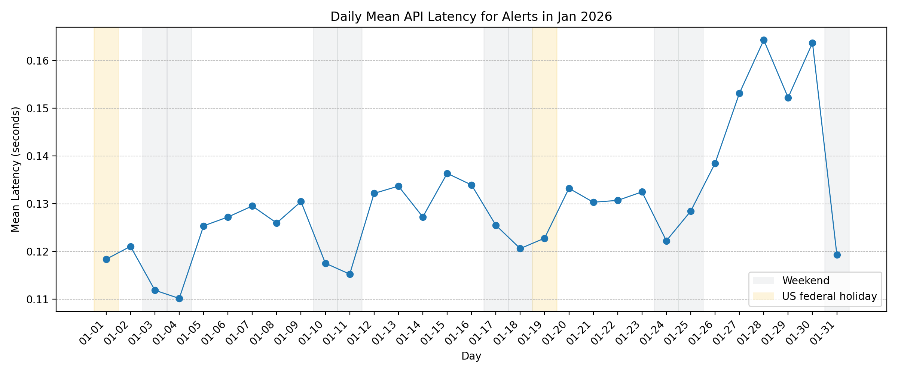

The alerts endpoint exhibited similar behavior, with most daily means ranging from ~0.11 to ~0.16 seconds. A temporary increase aligns with the storm period and minor transient errors, but did not persist.

### Data Volume & Storage Behavior

#### Archiving Sizes

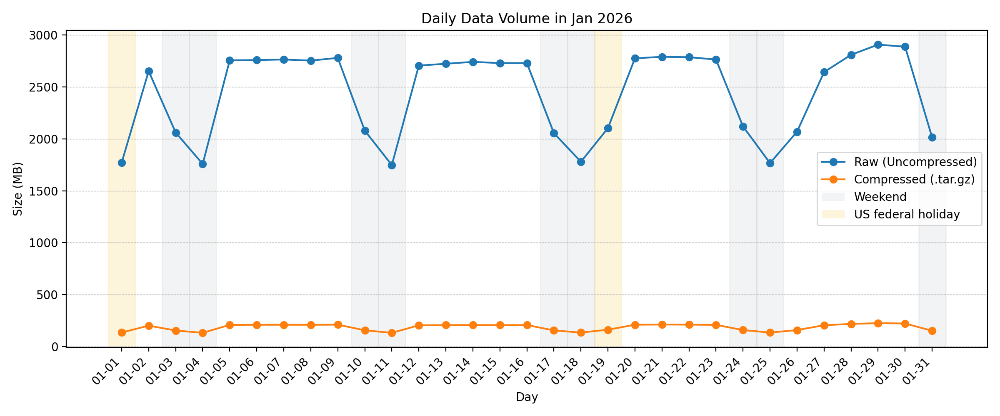

Daily raw data volume closely tracks real-world transit activity. Weekdays generate higher volumes (~2.7–2.9 GB uncompressed), while weekends dip to ~1.75–2.1 GB. This pattern aligns with reduced weekend service frequency and lower vehicle counts.

A noticeable drop on January 26–27 coincides with the major winter storm in the Boston area. Reduced service and vehicle cancellations likely contributed to the lower raw data volume during this period.

Compression remained stable across the month, with compressed archives scaling proportionally to raw volume. This indicates consistent data structure and predictable storage behavior under varying transit conditions.

#### Compression Ratio

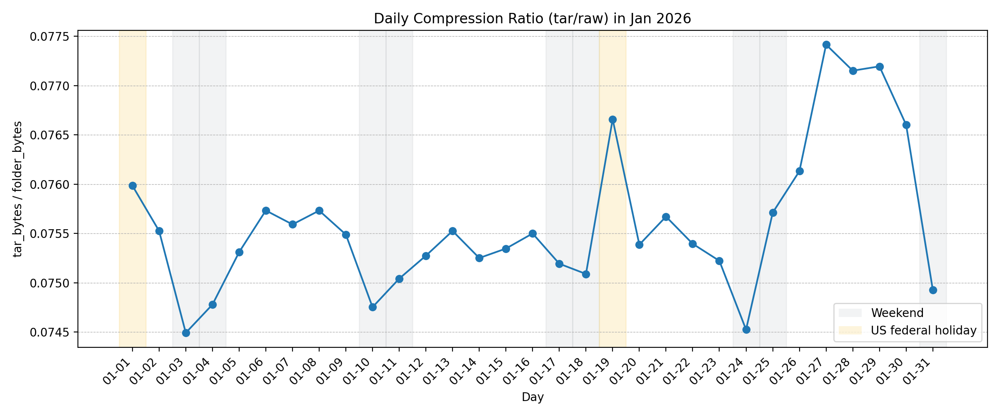

The daily compression ratio (compressed size ÷ raw size) remained highly stable throughout January, averaging ~0.075. This indicates that archived data consistently compresses to roughly 7.5% of its original size (a ~92–93% reduction).

Day-Day-to-day variation was minimal, even during weekends and the late-month storm window. The stability of this ratio suggests a consistent data structure and predictable archival results across varying transit volumes.

#### Compression Throughput

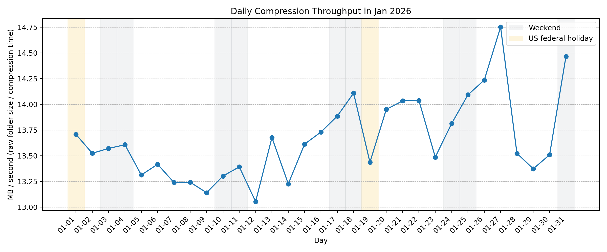

Compression throughput (raw folder size ÷ compression time) remained consistently between ~13 and 14.7 MB/sec throughout January. Minor day-to-day variation is visible, with a slight increase during the final week of the month, but no sustained degradation or instability.

Throughput remained stable across weekdays, weekends, and the late-month storm window, indicating consistent droplet performance under varying data volumes. Overall, archival processing capacity comfortably handled the daily workload without signs of CPU contention or resource bottlenecks.

#### Scatter Raw vs Compressed Time

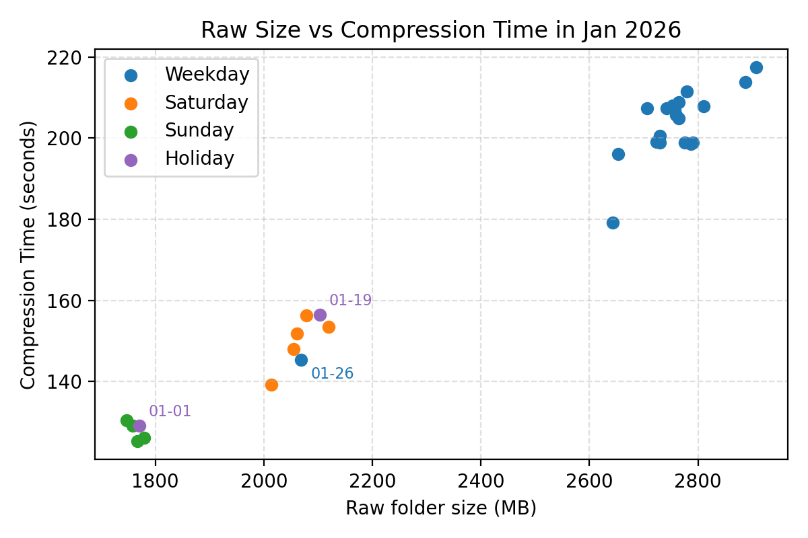

Each point represents a single day, plotting raw folder size against total compression time. A clear linear relationship appears: larger raw volumes correspond proportionally to longer compression durations.

The lower values on January 26 align with reduced raw data volume during the late-month winter storm. Compression time decreased accordingly, maintaining the same scaling pattern.

No nonlinear spikes or disproportionate increases appear. Compression performance scales predictably with input size, indicating stable archival behavior across varying transit activity levels.

### Archive Job Performance

#### Total Runtime

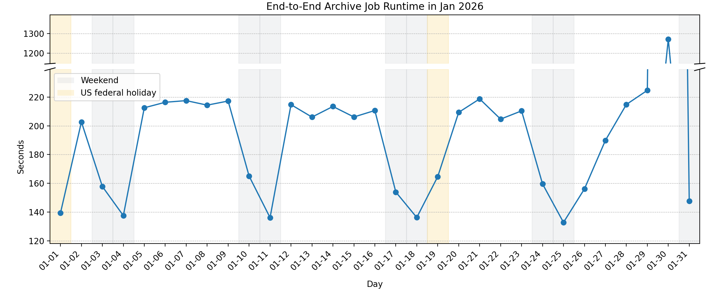

This metric reflects the total runtime of archive jobs, including compression, upload to Backblaze B2, and post-processing cleanup.

For most of January, the end-to-end runtime ranged from ~130 to ~220 seconds, scaling predictably with daily data volume. However, a single significant outlier occurred on January 30 (~1,270 seconds).

This spike likely reflects transient network or I/O contention during upload rather than compression inefficiency, as compression throughput remained stable during the same period. The following day, it returned to baseline levels, indicating automatic recovery without cascading delays or missed runs.

#### Upload Throughput to B2

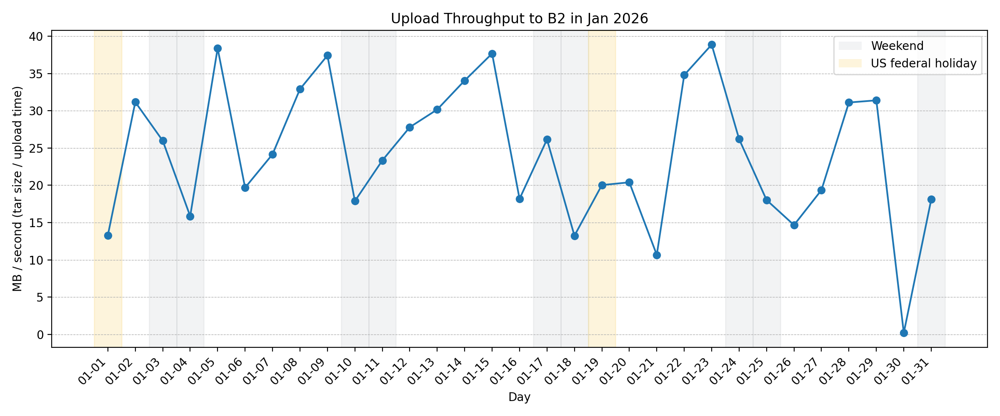

This metric represents upload throughput, calculated as compressed archive size divided by upload time.

Upload speeds fluctuated between ~10–40 MB/s throughout the month, consistent with expected network variability. However, January 30 shows a near-zero throughput value.

This aligns directly with the significant runtime spike in the end-to-end archive job. Because compression throughput remained stable during this period, the anomaly is most consistent with a transient network bottleneck during upload rather than local CPU or disk contention.

The following day, the throughput returned to normal, indicating the issue was isolated and self-resolving.

## Observed Transit System Patterns

### Active Vehicles

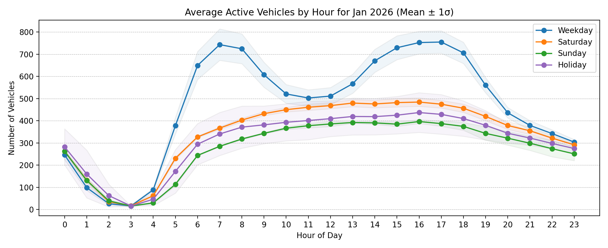

Weekdays show a clear bimodal commute pattern, with strong peaks around 7–9 AM and 3–6 PM. Weekends are flatter and lower, reflecting reduced service and demand. Holidays track closer to weekends than weekdays, with softened morning peaks.

The late-month winter storm (Jan 26–27) likely depressed vehicle counts on one weekday and one Sunday, slightly widening variance bands. Despite that anomaly, the overall pattern remains stable.ts/active_hourly_alerts.png)

Alerts follow a similar daily cycle, rising through the morning and peaking in the afternoon. Weekdays show the highest alert volume, while Saturdays and holidays remain moderate.

The elevated Sunday variance aligns with the late-January winter storm, which likely contributed to the increase in service alerts during that period.

### Daily Alerts

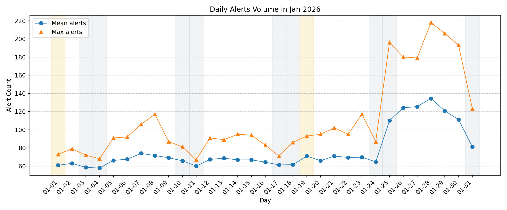

For most of the month, mean alert counts remained stable (~60–75 per day), with predictable daily peaks under ~120. These totals include routine, persistent alerts, such as elevator outages, to form a steady operational baseline. Counts reflect active posted alerts rather than distinct incidents, so long-running notices naturally elevate the baseline.

Beginning Jan 25, both the mean and maximum alert counts increased sharply, with daily peaks exceeding 200. This aligns with the late-January winter storm (Jan 26–27), suggesting a temporary surge in service disruptions layered on top of the normal alert baseline.

## Lessons Learned

What began as a simple visualization experiment became a surprisingly timing-sensitive system. The main challenge was not collecting data, but collecting it at precise, consistent moments. At 10-second intervals, even small scheduling offsets can accumulate, leading to drift that compromises data consistency and downstream analysis. Maintaining stable timing proved to be one of the most important design considerations.

Another main takeaway from this experience was that system resilience matters more than perfection. Even with a few missed calls, the dataset remained reliable, as interpolation could address occasional gaps, and overall success was around 99%. Realizing the system still ran smoothly despite minor errors helped shift the focus from chasing absolute perfection toward building something robust and trustworthy over time.
